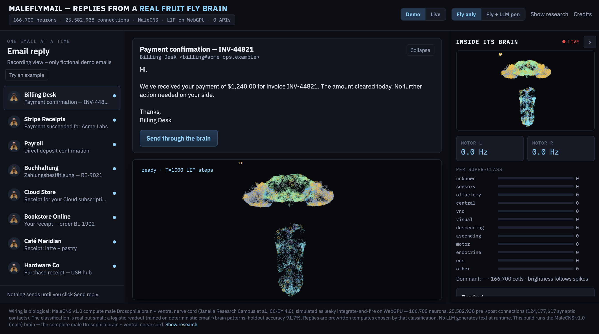
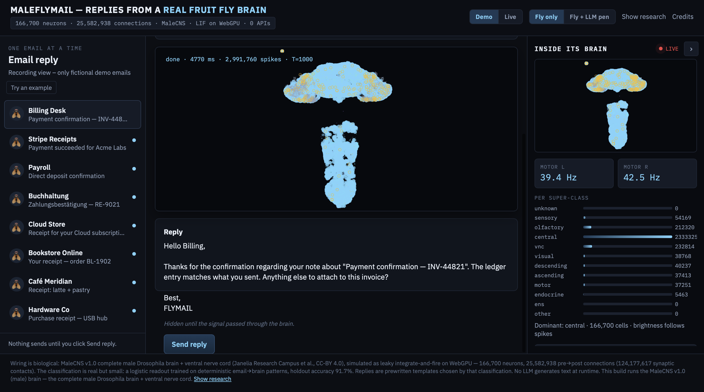

# MALEFLYMAIL

**Email replies from a real fruit-fly brain — the male one.**

MALEFLYMAIL streams a real email into a simulated *Drosophila melanogaster*
connectome — the **MaleCNS v1.0** complete **male** brain **and ventral nerve
cord** — runs ~1,000 leaky integrate‑and‑fire (LIF) time steps on the GPU, and
reads the fly's activity back out as a reply. No LLM writes the words. A small
logistic readout maps the brain state to a category and picks a template; an
optional local Ollama model (the "pen") can then polish the reply.

```
 166,700 neurons · 25,582,938 connections · MaleCNS v1.0 · LIF on WebGPU · 0 AIs
```

> This is the male sibling of **flymail**, which runs the **FAFB** female
> whole brain (139,255 neurons). Same engine, same binary brain format —
> different (bigger, VNC‑including) dataset, so this project is **fully
> self‑contained**: its own `brain.bin`, its own download/build pipeline,
> its own ports.

## Screenshots

Demo inbox + MaleCNS brain ready (before a run):



After 1000 LIF steps — reply unlocked, motor L/R gauges and per‑superclass bars live:



Screen recording of a full run:

[screenshots/demo.mov](screenshots/demo.mov)

---


## What's inside


| Piece            | Path                     | What it is                                                                |
| ---------------- | ------------------------ | ------------------------------------------------------------------------- |
| Frontend         | `src/`                   | React + Vite UI: inbox, brain viz, L/R motor gauges, per‑superclass panel |
| WebGPU engine    | `src/engine/`            | LIF simulator, CSR graph loader, WGSL compute shaders, driver, heat       |
| Brain binary     | `public/brain.bin`       | 210 MB MaleCNS connectome in the `WGFLYBRN` v1 format                     |
| Readout          | `public/readout.json`    | Fitted logistic classifier (email → category) + features                  |
| Readout fitter   | `tools/fit_readout.py`   | `reports.csv` → `readout.json` (sklearn, seed=42)                         |
| Brain builder    | `tools/build_csr.py`     | MaleCNS feathers → `brain.bin` (pandas/pyarrow)                           |
| Data fetcher     | `tools/download_data.sh` | Pinned, sha256‑verified fetch of the 3 source feathers (~1.2 GB)          |
| Report runner    | `tools/run_reports.mjs`  | Headed Chrome + WebGPU → `data/reports.csv`                               |
| Screenshot tool  | `scripts/shoot.mjs`      | Renders the app and captures hero/toggle/LLM media                        |
| Live mail server | `server/index.mjs`       | Gmail (App Password) or IONOS IMAP over REST on port 5177                 |
| Ollama pen       | `src/llm.ts`             | Optional local LLM that rewrites the template reply                       |


## Why "male" and "better"?

- **MaleCNS v1.0** is a complete connectome of the **male** fly, including the
**ventral nerve cord (VNC)** — the body wiring the female FAFB whole brain
release does not ship with. That's why this fly has real L/R motor gauges.
- **Bigger**: 166,700 neurons / 25.6 M edges / 124.2 M synaptic contacts vs
FAFB's 139,255.
- **Self‑contained**: `flymail` symlinks its `brain.bin` to `webgpu-fly`. This
repo builds and commits its own, so it stands alone on a fresh clone.


## Quick start

```bash
npm install
npm run dev            # http://localhost:5176  (brain.bin must be present)
```

If `public/brain.bin` is missing (fresh clone), build it:

```bash
bash tools/download_data.sh                 # ~1.2 GB, sha256-verified
python3 tools/build_csr.py                  # needs pandas + pyarrow
```


## The full pipeline (`reproduce.sh`)

Demo mode does **not** need this — `public/readout.json` is already committed.
Use `./reproduce.sh` only when you want to regenerate reports, re-fit the
readout, and refresh screenshots end-to-end:

```bash
./reproduce.sh
```

**Steps:** typecheck → build → serve preview → collect WebGPU reports from the
training corpus (headed Chrome) → fit the logistic readout → rebuild → capture
screenshots → print holdout accuracy.

### Sibling dependency: train-your-fly

The fit step in `reproduce.sh` calls:

```bash
../train-your-fly/.venv/bin/python tools/fit_readout.py
```

That expects a checkout of
[eudald-seeslab/train-your-fly](https://github.com/eudald-seeslab/train-your-fly.git)
**next to** this repo (same parent directory), with its `.venv` created and
`scikit-learn` / `numpy` available there. Layout:

```
parent/
├── maleflymail/          # this repo
└── train-your-fly/       # clone + venv
    └── .venv/
```

```bash
# from the parent of maleflymail/
git clone https://github.com/eudald-seeslab/train-your-fly.git
cd train-your-fly
python3 -m venv .venv
source .venv/bin/activate
pip install numpy scikit-learn   # enough for fit_readout.py
```

**Without the sibling:** skip `reproduce.sh` and fit with any Python that has
numpy + sklearn:

```bash
npm run build
npm run preview                  # keep :5176 up
MALEFLYMAIL_URL=http://127.0.0.1:5176 MALEFLYMAIL_HEADED=1 node tools/run_reports.mjs
python3 tools/fit_readout.py     # or: npm run fit
npm run build
```

`train-your-fly` is **not** used at inference — only as a convenient sklearn
venv for re-fitting. The shipped app and Demo inbox run from this repo alone.

## Live email (optional)

```bash
cp server/.env.example server/.env    # fill in Gmail App Password or IONOS IMAP
node server/index.mjs                 # REST API on :5177, proxied by vite
```

Click **Live** in the UI to switch the inbox from the demo corpus to your real
mailbox. Nothing sends until you click *Send reply*.

## Ports


| Service            | Port     |
| ------------------ | -------- |
| Vite dev / preview | **5176** |
| Mail REST server   | **5177** |


(flymail uses 5174/5175, webgpu‑fly 5173 — kept separate so both can run side
by side.)

## Data & provenance

- **Dataset:** MaleCNS v1.0, flat connectome, minconf‑0.5.
- **Source:** `storage.googleapis.com/flyem-male-cns/v1.0/connectome-data/flat-connectome/`
- **License:** CC BY 4.0.
- **Provenance:** pinned in `tools/download_data.sh` (sha256) and echoed into
`public/brain.meta.json` (per‑file hashes + `brain.bin` hash). Node policy:
every annotation with a non‑empty `superclass` and `status != Glia`
(166,700 neurons). Edge policy: all released minconf‑0.5 edges between
retained entries; weight = synaptic‑contact count pre‑signed by the
presynaptic consensus neurotransmitter.

See `NOTICE.md` for attribution.

## License

This project is released under the **MIT License** — see [`LICENSE`](LICENSE).

Upstream engine code from [webgpu-fly](https://github.com/abgnydn/webgpu-fly)
is also MIT (copyright Ahmet Barış Günaydın); the MaleCNS connectome data is
**CC BY 4.0**. Full credits in [`NOTICE.md`](NOTICE.md).

## Repo layout

```
maleflymail/
├── src/                 # React app + WebGPU engine (TS)
│   └── engine/          # brain.ts, sim.ts, shaders, driver, cache, simParams
├── public/              # brain.bin, brain.meta.json, readout.json, NOTICE, results
├── tools/               # download_data.sh, build_csr.py, fit_readout.py,
│                        # run_reports.mjs, smoke.mjs
├── scripts/             # shoot.mjs (screenshots)
├── server/              # index.mjs (Gmail/IONOS REST), .env.example
├── data/                # reports.csv (training corpus, gitignored-ish)
├── media/               # generated screenshots + smoke.json
├── screenshots/         # README demo images + screen recording
├── prompts/             # Cursor prompts (phaseN-cursor-prompt.md)
├── AGENTS.md            # agent operating notes
├── LICENSE              # MIT
├── NOTICE.md            # upstream attribution (engine + MaleCNS)
└── reproduce.sh
```


## Development

```bash
npx tsc --noEmit         # typecheck
npm run build            # production build → dist/
node tools/smoke.mjs     # load brain in headed Chrome, think 3 emails
```

---

